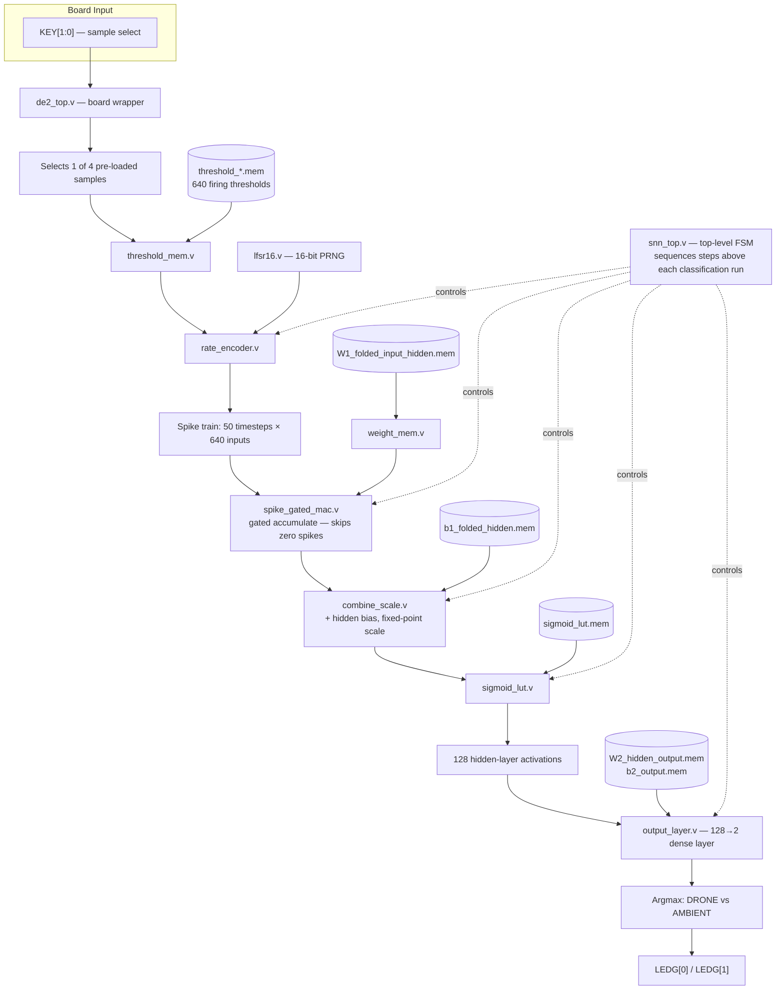
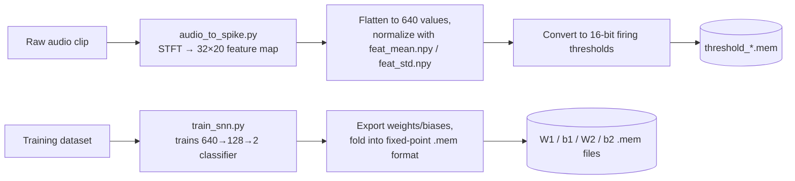

# Acoustic SNN Drone Detection — FPGA Implementation

Real-time acoustic drone-vs-ambient classification using a Spiking Neural
Network (SNN), implemented end-to-end from audio preprocessing in software
through synthesis and deployment on a Terasic DE2-115 FPGA board.

## Overview

- **Pipeline:** 16 kHz mono audio → STFT (256-pt FFT, hop 64, Hann window)
  → 32×20 feature map → flattened 640-value input → 16-bit LFSR
  rate-coded spike encoding (50 timesteps) → 640→128→2 classifier
  (DRONE / AMBIENT)
- **Target board:** Terasic DE2-115 (Cyclone IV EP4CE115F29)
- **Status:** RTL verified in simulation (bit-exact against the golden
  software reference), synthesized clean, deployed and tested on hardware
  for 4 pre-loaded sample cases.
- **Accuracy:** 97.9% classification accuracy on the test set.

## Architecture

The system is split into two stages: an **offline software pipeline** that
converts audio into spike-encoding parameters, and an **on-chip hardware
pipeline** that runs the actual spiking network and classification on the
FPGA. Only the hardware stage runs at demo time — audio features are
pre-computed and baked into ROM at synthesis time, since there is no live
audio input path.

### Pipeline stages

1. **`de2_top.v`** interfaces the FPGA board with the user through
   `KEY[1:0]` and `LEDG[1:0]`, selecting one of four pre-loaded audio
   samples.
2. The selected sample's 640 firing thresholds are read from the
   corresponding **`threshold_*.mem`** file through **`threshold_mem.v`**.
3. **`rate_encoder.v`** uses these thresholds along with the deterministic
   pseudo-random sequence from **`lfsr16.v`** to convert the 640 features
   into binary spikes over 50 timesteps.
4. These **50 × 640 spike events** are stored and sequentially processed
   by the hidden layer.
5. **`spike_gated_mac.v`** uses each spike to decide whether the
   corresponding input-to-hidden weight should be accumulated, skipping
   computation for zero spikes.
6. Weights are supplied from **`W1_folded_input_hidden.mem`** through the
   generic **`weight_mem.v`** module, while **`combine_scale.v`** adds the
   hidden bias and performs fixed-point scaling.
7. **`sigmoid_lut.v`**, using **`sigmoid_lut.mem`**, applies the sigmoid
   activation to produce 128 hidden-layer outputs.
8. These 128 outputs are passed to **`output_layer.v`**, which performs the
   dense 128→2 computation using **`W2_hidden_output.mem`** and
   **`b2_output.mem`**.
9. The two resulting scores are compared via argmax to classify the sample
   as **drone** or **ambient**.
10. **`snn_top.v`** controls this entire sequence through its FSM; the
    classification result is returned to **`de2_top.v`** and displayed on
    the FPGA LEDs.

## Offline software pipeline

Runs once, in advance, to produce the ROM contents the hardware consumes —
not part of the on-chip datapath.

## Repo layout

| Folder | Contents |
|---|---|
| `software/` | Python preprocessing pipeline (`audio_to_spike.py`), training script (`train_snn.py`), normalization stats (`feat_mean.npy`, `feat_std.npy`) |
| `rtl/` | Verilog source — SNN core modules, board wrapper (`de2_top.v`) |
| `mem/` | ROM initialization files — weights, biases, sigmoid LUT, per-sample firing thresholds |
| `tb/` | Testbenches used for RTL / golden-model verification |
| `quartus/` | Quartus project files, pin assignments (`de2_top_pins.qsf`), timing constraints (`neuro.sdc`), compiled bitstream (`neuro.sof`) |
| `docs/` | Project handover notes and design history |

## Hardware bring-up

Board interface (`de2_top.v`) on the Terasic DE2-115:

| Signal | Pin | I/O Standard | Role |
|---|---|---|---|
| `CLOCK_50` | PIN_Y2 | 2.5 V | 50 MHz system clock |
| `KEY[0]` | PIN_M23 | 2.5 V | Sample-select bit 0 (active-low) |
| `KEY[1]` | PIN_M21 | 2.5 V | Sample-select bit 1 (active-low) |
| `LEDG[0]` | PIN_E21 | 2.5 V | Lit when classified DRONE |
| `LEDG[1]` | PIN_E22 | 2.5 V | Lit when classified AMBIENT |

`KEY[1:0]` selects among 4 pre-loaded audio samples. Both LEDs stay off
until classification completes (`result_valid` gate).

## Known limitations

- No live audio input — sample features are pre-computed in software and
  baked into ROM (`.mem` files) at synthesis time.
- `KEY[1:0]` input is not debounced.
- One known drone sample is misclassified as ambient — a model-level
  limitation reproduced in the floating-point reference model, not a
  hardware bug.

## Build / run

1. Open `quartus/neuro.qpf` in Quartus.
2. Confirm top-level entity is `de2_top`
   (`Assignments → Settings → General`).
3. Confirm `quartus/neuro.sdc` is set as the SDC timing file.
4. `Processing → Start Compilation`.
5. `Tools → Programmer` → load `quartus/neuro.sof` via JTAG (USB-Blaster),
   or recompile to regenerate it.
6. Press `KEY[1:0]` combinations and observe `LEDG[0]` / `LEDG[1]`.